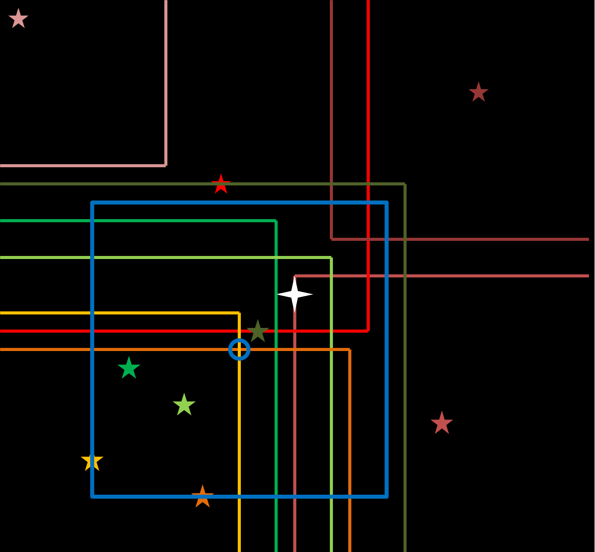

```{r bibtex, echo = F, message=FALSE, warning=F, cache = F}
download.file("https://raw.githubusercontent.com/eugene100hickey/LocusAlgorithm/master/Locus_Paper/Locus_Whole/library.bib", "library.bib")
```


# Introduction

Photometric variability studies involve identifying variations in brightness of a celestial point source over time. Such studies are hampered by the Earth's atmosphere, which causes first order and second order extinction @Milone2011 @YOUNG1991. Differential Photometry mitigates the effect of the Earth's atmosphere by comparing the brightness of a target to reference stars in the same Field of View (FoV). Differential photometry can be optimised for the target by choosing a pointing whose Field of View (FoV) includes the target and the maximum number of reference stars of similar magnitude and colour. @Milone2011 @YOUNG1991 @Howell2000 @Honeycutt1992.

The Locus Algorithm enables optimised differential photometry by identifying the pointing for which the resultant FoV includes the target and the best set of similar reference stars available.


# Conceptual basis to The Locus Algorithm

A locus can be defined around any star such that a FoV centred on any point on the locus will include the star at the edge of the FoV. For fields containing stars close to one another, if one locus intersects with another, they produce Points of Intersection (PoIs) (Figure 1).


```{r fig1, fig.cap="Diagrammatic representation of two stars with loci (red and blue perimeter lines), which intersect and produce two Points of Intersection (PoI's) circled in yellow.", echo=F}
knitr::include_graphics('https://raw.githubusercontent.com/eugene100hickey/LocusAlgorithm/master/Locus_Paper/Locus_Whole/fig1.png')
```


A FoV centred on any such PoI will include both stars associated with creating it. At Points of Intersection the set of stars that can be included in a FoV changes.

The Locus Algorithm considers candidate reference stars in what is termed a Candidate Zone (CZ) - the zone of sky centred on the target within which a FoV can be selected which includes both the reference star and the target. Within the Candidate Zone, all relevant Points of Intersection are identified. Each PoI is assigned a score derived from the number and similarity of reference stars included in it's resulting FoV. The PoI with the highest score becomes the pointing for the target.


# Locus Algorithm Design

## Definition of Coordinate System and Locus

For computational efficiency, The Locus Algorithm considers a Field of View to be a rectangular area on the sky orientated such that the edges are aligned with the primary x and y axes of the Cartesian coordinate system. Movement of the field is restricted to x or y translations.

However, the Celestial coordinate system is defined by the Equatorial coordinate system, with coordinates specified by Right Ascension (RA) and Declination (Dec). Because this is a spherical coordinate system, unit angle in RA is foreshortened, with the degree of foreshortening defined by:

$$angle \in RA = {\frac{True Angle}{cosine(Dec)}} \tag{Equation 1: Right Ascension foreshortening with Declination}$$

By using this conversion, it is possible to approximate to a high degree of accuracy a Cartesian coordinate system using RA and Dec; with a small FoV of horizontal size R and vertical size S about a star located at point $RA_c$ and $Dec_c$ , where

$$R^` = {\frac{R}{cos(Dec_c)}}$$
as:

$$RA_c - {\frac{R^`}{2}} \leq RA \leq RA_c + {\frac{R^`}{2}} $$

$$Dec_c - {\frac{S}{2}} \leq Dec \leq Dec_c + {\frac{S}{2}}$$

Equation 2. Definition of a FoV of size R x S centred on a point ($RA_c$ , $Dec_c$)


This definition is accurate to approximately 1% for a FoV of area 15' square outside celestial polar regions; and does not consider RA "loop around" from 359.99$^{\circ}$ to 0.00$^{\circ}$; resulting, for example, in the exclusion of 0.23% of the SDSS catalogue. Planned enhancements to The Locus Algorithm will resolve these shortcomings.

We can therefore define the locus about any star on the sky located at $RA_c$ and $Dec_c$ as the values of Right Ascension and Declination as defined in Equation 2.


## Candidate Zone

A Candidate Zone is defined as a region centred on the target, equal to four times the area of any Field of View (Equation 3), within which any reference star can be included in a Field of View with the target and can therefore be considered as a candidate reference star in identifying the optimum pointing. Conversely, stars outside the candidate zone cannot be included in a Field of View with the target and cannot therefore be considered as candidates reference stars. Hence the Candidate Zone is the maximum region of sky centred on the target from which to choose candidate reference stars when identifying an optimum pointing for a given target. For a target positioned at coordinates $RA_c$ and $Dec_c$ the resulting Candidate Zone is defined by:

$$RA_c - R^` \leq RA \leq RA_c + R^` $$

$$Dec_c - S \leq Dec \leq Dec_c + S$$

Equation 3. Definition of a Candidate Zone of size 2R x 2S centred on a target  with  coordinates ($RA_c$, $Dec_c$)

```{r fig2, fig.cap='Modified image taken from the SDSS "Navigate" tool. The image showing fields (in red) needed to form a mosaic from which a Candidate Zone (green) centred on the target can be defined.', echo=F}
knitr::include_graphics('https://raw.githubusercontent.com/eugene100hickey/LocusAlgorithm/master/Locus_Paper/Locus_Whole/fig2.png')
```

## Identification and Filtering of Reference Stars

For each target, a list of candidate reference stars in its Candidate Zone is produced based on the following criteria:

* Position: the reference star must be in the Candidate Zone.
* Magnitude: the reference star must be within a user-defined limit of the target's magnitude.
* Colour: the reference star must match the colour of the target to within a user-specified limit.
* Resolvability: the reference star must be resolvable, i.e. no other star that would impact a brightness measurements within a user-specified resolution limit.

All stars in the Candidate Zone which pass these initial filters become the list of candidate reference stars from which loci will be identified.


## Identifying the Effective Locus for each Candidate Reference Star

The locus associated with each candidate reference star must be identified based on Equation 2. For the purposes of identifying Points of Intersection, only the side surrounding a given candidate reference star closest to the target need be considered. Hence, we can define the effective locus for such a candidate reference star as a single line of constant RA and a single line of constant Dec nearest the target star (Figure 3).


```{r fig3, fig.cap="Each effective locus is defined by assigning a pair of RA and Dec coordinates for a corner point and a pair of lines North or South and East or West from the corner point. In this diagram, each candidate reference star is assigned a colour, and the effective locus  that corresponds to it is drawn in the same colour.", echo=F}
knitr::include_graphics('https://raw.githubusercontent.com/eugene100hickey/LocusAlgorithm/master/Locus_Paper/Locus_Whole/fig3.png')
```

Specifically, the effective locus can be defined as a corner point of the locus and two lines: one of constant RA and the other of constant Dec emanating from the corner point. The direction of the lines is determined by the Right Ascension and Declination of the candidate reference star relative to the target; as follows:

* If the RA of the candidate is greater than the target, the line of constant Dec is drawn in the direction of increasing RA
* If the RA of the candidate is less than the target, the line of constant Dec is drawn in the direction of decreasing RA
* If the Dec of the candidate is greater than the target, the line of constant RA is drawn in the direction of increasing Dec
* If the Dec of the candidate is less than the target, the line of constant RA is drawn in the direction of decreasing Dec.

Using the Equatorial Coordinate System discussed in Section 3.1, with coordinates of the target specified by $(RA_{target}, Dec_{target})$ and coordinates of the candidate reference star defined by $(RA_{reference}, Dec_{reference})$ and a size of FoV of horizontal length R and vertical length S, the coordinates of the corner point $(RA_{corner-point}, Dec_{corner-point})$ are defined as:

$$RA_{target} \leq RA_{reference} \Rightarrow RA_{corner-point} = RA_{reference}- R^` $$

$$RA_{target} > RA_{reference} \Rightarrow RA_{corner-point} = RA_{reference}+ R^` $$

$$Dec_{target} \leq Dec_{reference} \Rightarrow Dec_{corner-point} = Dec_{reference}- {\frac{S}{2}} $$

$$Dec_{target} > Dec_{reference} \Rightarrow Dec_{corner-point} = Dec_{reference} + {\frac{S}{2}}$$

The direction of the lines of constant RA and Dec of the effective locus emanating from any such corner point are determined according to the criteria describe above.

## Identifying and Scoring Points of Intersection and identifying the pointing

The points where lines from any two loci are identified. This involves comparing the corner point RA and Dec and direction of lines for one locus with the corner point RA and Dec and direction of lines for a second locus.  In total eight variable associated with each two loci are checked:

* For Locus 1: $RA_1$, $Dec_1$, $DirRA_1$, $DirDec_1$
* For Locus 2: $RA_2$, $Dec_2$, $DirRA_2$, $DirDec_2$

Using these parameters, a check as to whether an intersection between the two loci occurs is achieved as follows:

* A line of constant Dec in the positive RA direction from the corner point of locus 1 will intersect with a line of constant RA in the positive Dec direction from the corner point of locus 2 if locus 1 has a lower RA than locus 2 and locus 1 has a higher Dec than locus 2.
* A line of constant RA in the positive Dec direction from the corner point of locus 1 will intersect with a line of constant Dec in the positive RA direction from the corner point of locus 2 if locus 1 has a lower Dec than locus 2 and locus 1 has a higher RA than locus 2.

... and so on. By checking all such possible combinations, all pairs of loci in the field which result in a Point of Intersection are identified and their RA and Dec noted.

Subsequent to identification, each Point of Intersection is then scored. This is achieved as follows:

* The number of reference stars in the Field of View centred on the Point of Intersection is counted.
* Each reference star is assigned a rating value between 0 and 1 based on its similarity in colour to the target.
* The ratings from all counted reference stars in the Field of View are combined into one overall score for the field (Figure 4).
* The Point of Intersection with the highest score becomes the pointing for the target (Figure 5).


```{r fig4, fig.cap="Points of Intersection (PoI), and their associated score. In this diagram each star has a rating of 1, hence the score associated with each PoI is equal to the number of reference stars within a FoV centred at that PoI.", echo=F}
knitr::include_graphics('https://raw.githubusercontent.com/eugene100hickey/LocusAlgorithm/master/Locus_Paper/Locus_Whole/fig4.png')
```

<!-- ```{r} -->
<!--  -->
<!-- ``` -->


```{r fig5, fig.cap="Locus Algorithm. Target: white star.  Pointing & FoV: blue.  Reference stars and their loci: Fully in the FoV: greens.  On the edge of the FoV: yellows.  Outside FoV: reds", echo=F}
knitr::include_graphics('https://raw.githubusercontent.com/eugene100hickey/LocusAlgorithm/master/Locus_Paper/Locus_Whole/fig5.png')
```

\newpage

Scenarios can arise which result in an inability to identify an optimum pointing for a given target for example if there are no, or a maximum of one reference stars in the candidate zone; and if no points of intersection arise – a scenario which can arise if two (or more) reference fall in one quadrant of the candidate zone resulting in concentric loci, or where reference stars are too far apart in different quadrants of the candidate zone in order for their loci to intersect. All four of these scenarios are considered in practical implementations of the locus algorithm aimed at identifying the optimum pointings for a set of targets in a catalogue or list of targets.

In summary, the Locus Algorithm successfully identifies the RA and Dec coordinates of the optimum pointing for a given target, where optimum means a field of view with the maximum number of reference stars which are similar in magnitude and colour to the target.


```{r setup, echo = F, message=FALSE, warning=F, cache = F}
#################################
require(RCurl)
require(tidyverse)
require(magrittr)
require(knitr)
require(kableExtra)
require(data.table)
#################################


```

```{r locus, echo = F, message=FALSE, warning=F, cache = T}
ObjID <- "1237680117417115655" # star
ObjID <- "1237674649391857845" #"1237648720693887182"
ObjID <- "1237651225171067249" # green publication QSO
# ObjID <- "1237651211213144306" # first QSO in publication 
ObjID <- "1237651224634851622" # second QSO in publication 
# SQL that downloads some info on the chosen target from SDSS.
# ObjID from SDSS specifies the target
targetSqlQuery <- paste("SELECT top 10 ra, dec, psfmag_u, psfmag_g, psfmag_r, psfmag_i, psfmag_z FROM photoObj WHERE ObjID = ", ObjID)

# downloads target data
# dataframe target has necessary info
targetSqlQuery <- str_squish(targetSqlQuery)
urlBase <- "http://skyserver.sdss.org/dr15/SkyserverWS/SearchTools/SqlSearch?"
X <- getForm(urlBase, cmd = targetSqlQuery, format = "csv")
target <- read.table(text = X, header = TRUE, sep = ",", dec = ".", comment.char = "#")

# sets some variables for convenience. Last two are the field sizes
# ra.size is automatically adjusted for each target depending on its dec
# M is the maximum colour difference
# resol is important for gauging crowded references
# dynamic range is to prevent saturation of either target or reference
u <- target$psfmag_u
g <- target$psfmag_g
r <- target$psfmag_r
i <- target$psfmag_i
z <- target$psfmag_z
ra <- target$ra
dec <- target$dec
M <- 0.1 # 0.1
dec.size = 10/60 # 0.167
dec.super = 10.5/60 # 0.172
ra.size = dec.size / cos(dec*pi/180)
ra.super = dec.super / cos(dec*pi/180)
resol <- 0.003
dynamic_range <- 2 # 5
crowd_mag_limit <- 5
degree_decimals <- 4
'%+%' <- function(x,y) paste(x,y,sep="")

# SQL that counts objects in reference area
mySqlQuery <- str_glue(
"SELECT objID, ra, dec, psfmag_u, psfmag_g, psfmag_r, psfmag_i, psfmag_z
FROM photoObj
WHERE (ra between ({ra - ra.size}) AND ({ra + ra.size})
OR ra BETWEEN ({360 + ra - ra.size}) AND ({360 + ra + ra.size})
OR ra BETWEEN ({-360 + ra - ra.size}) AND ({-360 + ra + ra.size}))
AND dec BETWEEN ({dec - dec.size}) AND ({dec + dec.size})
AND clean = 1
AND (calibStatus_r & 1) != 0")

# reads in data from SDSS.
# just counting how many objects in field
# doesn't care about mags
mySqlQuery <- str_squish(mySqlQuery)
X <- getForm(urlBase, cmd = mySqlQuery, format = "csv")
in_frame <- read.table(text = X, 
                header = TRUE, 
                sep = ",", 
                dec = ".", 
                comment.char = "#",
                colClasses = c("character", rep("numeric",7)))
Object_Count <- dim(in_frame)[1]
Magnitude_Range <- in_frame %>% 
  filter(between(psfmag_r, r - dynamic_range, r + dynamic_range)) 
Magnitude_Count <- dim(Magnitude_Range)[1]
Colour_Range <- Magnitude_Range %>% 
  filter(between((psfmag_g - psfmag_r) , g - r - M, g - r + M)) %>% 
  filter(between((psfmag_r - psfmag_i), r - i - M, r - i + M))
Colour_Count <- dim(Colour_Range)[1]

# SQL query that downloads data from SDSS for objects
# potentially in the same field as the target
mySqlQuery1 <-str_glue(
"SELECT objID, ra, dec, psfmag_u, psfmag_g, psfmag_r, psfmag_i, psfmag_z\n
FROM photoObj\n
WHERE (ra between ({ra - ra.size}) AND ({ra + ra.size})\n
OR ra BETWEEN ({360 + ra - ra.size}) AND ({360 + ra + ra.size})\n
OR ra BETWEEN ({-360 + ra - ra.size}) AND ({-360 + ra + ra.size})\n)
AND dec BETWEEN ({dec - dec.size}) AND ({dec + dec.size})\n
AND psfmag_r BETWEEN {r - dynamic_range} AND { r + dynamic_range} \n
AND (psfmag_g - psfmag_r) BETWEEN ({g - r - M}) AND ({g - r + M})\n
AND (psfmag_r - psfmag_i) BETWEEN ({r - i - M}) AND ({r - i + M})\n
AND clean = 1\n
AND (calibStatus_r & 1) != 0")

# reads in data from SDSS.
# dataframe called A has all the details
mySqlQuery <- str_squish(mySqlQuery1)

X <- getForm(urlBase, cmd = mySqlQuery, format = "csv")
A <- read.table(text = X, 
                header = TRUE, 
                sep = ",", 
                dec = ".", 
                comment.char = "#",
                colClasses = c("character", rep("numeric",7)))
Object_Count_mags <- dim(A)[1]

# wrap-around for targets near 0 RA
A$ra <- if_else(A$ra - target$ra > 180, A$ra - 360, A$ra) 
# wrap-around for targets near 360 RA
A$ra <- if_else(target$ra - A$ra > 180, A$ra + 360, A$ra)


# SQL query that downloads data from SDSS for objects
# potentially crowding the references

crowdingSqlQuery <- str_glue(
"SELECT objID, ra, dec, psfmag_r FROM photoObj
WHERE (ra between ({ra - ra.size}) AND ({ra + ra.size})
OR ra between ({360 + ra - ra.size}) AND ({360 + ra + ra.size})
OR ra between ({-360 + ra - ra.size}) AND ({-360 + ra + ra.size}))
AND dec between ({dec - dec.size}) AND ({dec + dec.size})
AND psfmag_r < {r + crowd_mag_limit} AND clean = 1
AND (calibStatus_r & 1) != 0")
crowdingSqlQuery <- str_squish(crowdingSqlQuery)
crowd <- getForm(urlBase, cmd = crowdingSqlQuery, format = "csv")
crowdA <- read.table(text = crowd, 
                      header = TRUE, 
                      sep = ",", 
                      dec = ".", 
                      comment.char = "#",
                      colClasses = c("character", rep("numeric",3)))
# wrap-around for crowding near 0 RA
crowdA$ra <- if_else(crowdA$ra - target$ra > 180, crowdA$ra - 360, crowdA$ra) 
# wrap-around for crowding near 360 RA
crowdA$ra <- if_else(target$ra - crowdA$ra > 180, crowdA$ra + 360, crowdA$ra)


# function to check for crowding
crowd <- function(x, y, z, a, b, c) {
  sum(abs(x - a) < resol
  & abs(y - b) < resol
  & c - z < dynamic_range)
}


# function to calculate rating. Uses Oisin's routine
rating <- function(gr, rr, ir) {
  gt <- g
  rt <- r
  it <- i
  delta.CS <- (gt - rt) - (gr - rr)
  delta.CL <- (rt - it) - (rr - ir)
  RS <- 1 - abs(delta.CS / M)
  RL <- 1 - abs(delta.CL / M)
  RS * RL
}

# looks for crowding
for (q in dim(A)[1]:1) {
  if (crowd(A$ra[q], A$dec[q], A$psfmag_r[q], crowdA$ra, crowdA$dec, crowdA$psfmag_r) > 1) A <- A[-q, ]
}

object_count_crowding <- dim(A)[1]

# calculate ratings for each potential reference
ratings <- rating(A$psfmag_g, A$psfmag_r, A$psfmag_i)

# add ratings to the data frame
A <- cbind(A, ratings)

##########################
# finds all intersection points for each pair of potential references
##########################
A_coords <- A %>% arrange(ra) %>% select(objID, ra, dec)

swap_ij <- function(u, v){
  i <- v
  j <- u
}

int_pts_finder <- function(i, j) {
  if (i < j) {
    if (abs(A_coords$dec[i] - A_coords$dec[j]) < dec.size) {
      if (abs(A_coords$ra[i] - A_coords$ra[j]) < ra.size)
      {
        ifelse(
          A_coords$dec[i] > A_coords$dec[j],
          z <- data.frame(
            int_ra = c(A_coords$ra[i] + ra.size / 2,
                       A_coords$ra[j] - ra.size / 2),
            int_dec = c(A_coords$dec[j] + dec.size / 2,
                        A_coords$dec[i] - dec.size / 2),
            objID_i = c(A_coords$objID[i], A_coords$objID[i]),
            objID_j = c(A_coords$objID[j], A_coords$objID[j])
          ),
          z <- data.frame(
            int_ra = c(A_coords$ra[i] + ra.size / 2,
                       A_coords$ra[j] - ra.size / 2),
            int_dec = c(A_coords$dec[j] - dec.size / 2,
                        A_coords$dec[i] + dec.size / 2),
            objID_i = c(A_coords$objID[i], A_coords$objID[i]),
            objID_j = c(A_coords$objID[j], A_coords$objID[j])
          )
        )
        return(z)
      }
    }
  }
}          
index_matrix <- expand.grid(1:dim(A)[1], 1:dim(A)[1])
names(index_matrix) <- c("i", "j")
int.pts <- pmap(index_matrix, int_pts_finder) %>% 
  rbindlist() %>% 
  filter(between(int_ra, ra-ra.size/2, ra+ra.size/2), 
         between(int_dec, dec-dec.size/2, dec+dec.size/2)) %>%
  distinct()
#####################################


# function that returns the score for each intersection point
score1 <- function(X, Y) {
  B <- A[abs(A$ra - X) <= ra.size / 2 + 0.001 & abs(A$dec - Y) <= dec.size / 2 + 0.001, ]
  sum(B$ratings)
}

# function that returns a dataframe with all references
# in a FOV defined by an intersection point
score2 <- function(X, Y) {
  A[abs(A$ra - X) <= ra.size / 2 + 0.001 & abs(A$dec - Y) <= dec.size / 2 + 0.001, ]
}

# calculates the score for each intersection point and orders them
int.pts$score <- mapply(score1, int.pts$int_ra, int.pts$int_dec)
int.pts <- int.pts[order(int.pts$score, decreasing = T), ]
int.pts <- int.pts %>% filter(objID_i != ObjID, objID_j != ObjID)

# prints out best pointing
# usually a bunch of ties  but just picks the first one
max.index <- which(int.pts$score == max(int.pts$score))
final_pointing <- data.frame(
  ra = int.pts[max.index[1], ]$int_ra,
  dec = int.pts[max.index[1], ]$int_dec,
  score = int.pts[max.index[1], ]$score
)

# makes data frame of reference stars for best pointing
B <- score2(int.pts[max.index[1], "int_ra"], int.pts[max.index[1], "int_dec"])
B <- B[with(B, order(ra)), c(1:9)]

corner1 <- which(A$objID == int.pts$objID_i[1])
corner2 <- which(A$objID == int.pts$objID_j[1])
```

\newpage

# Example Implementation of the Locus Algorithm

To illustrate the operations of the Locus Algorithm, a worked example is given here. The process described here in producing an optimal pointing for a given star follows the same sequence of steps described in the first part of this paper. The process is implemented in the R programming language and is geared for reproducible research. The code is available on _**[github](https://github.com/eugene100hickey/LocusAlgorithm)**_. It can be trivially adapted for different target stars and telescope parameters.

## Target

The star with SDSS ID `r ObjID`, henceforth called the target, (RA = `r format(round(ra, degree_decimals), nsmall = degree_decimals)` and DEC = `r format(round(dec, degree_decimals), nsmall = degree_decimals)`) is used as the example. This star, in the constellation Aquarius, has SDSS magnitudes as given in the table below.
\vskip 0.2in

```{r mag_table, echo = F}
star_mags <- data.frame(Band = c("u", "g", "r", "i", "z"), SDSS_Magnitude = c(u, g, r, i, z))
star_mags$SDSS_Magnitude %<>% round(., 2) 
kable(star_mags) %>%
  kable_styling()
```

The observational parameters are taken from the telescope at [Blackrock Castle Observatory](www.bco.ie). This telescope has parameters given in the table below:
\vskip 0.2in

```{r telescope, echo = FALSE, message = FALSE, warning = FALSE, tidy = FALSE}
telescope <- data.frame(
  Parameters = c(
    "Field of View in degrees",
    "Resolution Limit in degrees",
    "Dynamic Range in magnitudes",
    "Colour Match Limit"
  ),
  Values = c(
    round(dec.size * 1, 4),
    round(resol * 1, 4),
    round(dynamic_range, 4),
    round(M, 4)
  )
)
telescope %>%
  kable() %>%
  kable_styling()
```

## Candidate Zone

The size of the FoV when corrected for shortening by declination is, by equation 1 above, 

\[
R^` = {\frac{R}{cos(Dec_c)}}
\]

\[ 
= `r format(round(dec.size, degree_decimals), nsmall = degree_decimals)` ^{\circ}/ cos(`r format(round(dec, degree_decimals), nsmall = degree_decimals)` ^{\circ}) 
\]

\[
 = `r signif(dec.size / cos(dec*pi/180), 5)` ^{\circ}
\]

The locus of the target is, by equation 2 above,

\[
 `r format(round(ra - ra.size/2, degree_decimals), nsmall = degree_decimals)` ^{\circ} \leq RA \leq `r format(round(ra + ra.size/2, degree_decimals), nsmall = degree_decimals)` ^{\circ}
\]
 
\[
 `r format(round(dec - dec.size/2, degree_decimals), nsmall = degree_decimals)` ^{\circ} \leq Dec \leq `r format(round(dec + dec.size/2, degree_decimals), nsmall = degree_decimals)` ^{\circ}
\]

The candidate zone as defined above is the area of sky within which reference stars can possibly be included in the same field of view as the target. This is four times the size of the FoV and is given by equation 3 above,

\[
`r format(round(ra - ra.size, degree_decimals), nsmall = degree_decimals)` ^{\circ} \leq RA \leq `r format(round(ra + ra.size, degree_decimals), nsmall = degree_decimals)` ^{\circ}
\]

\[
`r format(round(dec - dec.size, degree_decimals), nsmall = degree_decimals)` ^{\circ} \leq Dec \leq `r format(round(dec + dec.size, degree_decimals), nsmall = degree_decimals)` ^{\circ}
\]

\newpage

## Identification and Filtering of Reference Stars

The potential reference stars are selected as follows:

* Position: Within the Candidate Zone, SDSS records `r Object_Count` separate objects with clean photometry, (@Aguado2018). These are downloaded by an SQL query run on the CAS database, release DR15
* Magnitude: the reference star must be within the dynamic range, `r dynamic_range`, of the target's magnitude of `r round(r, 3)`, e.g. `r round(r, 3)-2` $\leq$ r $\leq$ `r round(r, 3) + 2`. This leaves `r Magnitude_Count` potential references.
* Colour: the reference star must match the colour of the target to within a user-specified limit. In this case this means $g - r$  between `r round(g-r-M, 3)` and `r round(g-r+M, 3)` and $r - i$  between `r round(r-i-M, 3)` and `r round(r-i+M, 3)` This leaves `r Colour_Count` potential references.
* Resolvability: the reference star must be resolvable, i.e. no other star that would impact a brightness measurements within a user-specified resolution limit, in this case `r signif(resol*3600, 2)` arc seconds, (`r signif(resol, 3)` degrees). Any object this close to a potential reference star and with an r-band magnitude which is `r crowd_mag_limit` magnitudes greater than the potential reference or brighter will pollute the light from the potential reference star. This leaves `r object_count_crowding` potential references.

These numbers are presented in the table below.
\vskip 0.2in

```{r filter_table, echo = F}
reference_numbers <- data.frame(filters = c("Position, in Field of View", 
                                            "Correct Magnitude", 
                                            "Correct Colour",
                                            "Resolvable", 
                                            "In Final Field of View"), 
                                numbers = c(Object_Count, 
                                            Magnitude_Count,
                                            Colour_Count, 
                                            object_count_crowding,
                                            dim(B)[1]))
kable(reference_numbers) %>%
  kable_styling()
```

\vskip 0.2in

The table below gives the `r object_count_crowding` stars in the candidate zone along with the highlighted `r dim(B)[1]` stars in the final field of view. The target star itself is shown highlighted in green.

\vskip 0.2in

```{r reference_table_all, echo=F, message=F, warning=F}
options(knitr.table.format = "latex")
target_number <- A$objID == ObjID
final_stars <- as.logical(A$objID %in% B$objID - target_number)

A %>%
  rownames_to_column(var = "ref.") %>% 
  mutate_if(is.numeric, round, 4) %>% 
  mutate_at(vars(starts_with("psfmag")), round, 2) %>% 
  rename_at(vars(starts_with("psfmag")), funs(str_replace(., "psfmag_", ""))) %>%
  kable() %>% 
  kable_styling(full_width = F) %>%
  row_spec(which(final_stars), bold = T, color = "white", background = "#D7261E") %>%
  row_spec(which(target_number), bold = T, color = "white", background = "#0D4A05")

```


The table above also includes ratings for each star. This gives a measure of how close, spectrally, each reference star is to the target. This rating hasn't been optimised and is the subject of further research by our group, but for the purpose of this work was calculated as follows:
\[
rating =(1- \abs{\frac{\delta g - \delta r}{M}}) \times (1-\abs{\frac{\delta r - \delta i}{M}})
\]

Where $\delta r$ stand for the difference between the r-band magnitude for the target and the reference star and M is the colour match limit. Similarly for $\delta g$ and $\delta i$.

For example, the star SDSS`r A$objID[corner1]` (Star `r rownames(A)[corner1]` on figure N) has g$_r$ = `r round(A$psfmag_g[corner1], 3)`, r$_r$ = `r round(A$psfmag_r[corner1], 3)`, and i$_r$ = `r round(A$psfmag_i[corner1], 3)`. This compares to the target magnitudes of g$_t$ = `r round(g, 3)`, r$_t$ = `r round(r, 3)`, and i$_t$ = `r round(i, 3)`.

This gives:
$\delta g$ = `r round(A$psfmag_g[corner1], 3)` - `r round(g, 3)` = `r round(A$psfmag_g[corner1] - g, 3)`.
$\delta r$ = `r round(A$psfmag_r[corner1], 3)` - `r round(r, 3)` = `r round(A$psfmag_r[corner1] - r, 3)`.
$\delta i$ = `r round(A$psfmag_i[corner1], 3)` - `r round(i, 3)` = `r round(A$psfmag_i[corner1] - i, 3)`.
Thus rating = (1 - (|`r round(A$psfmag_g[corner1] - g, 3)` - `r round(A$psfmag_r[corner1] - r, 3)`)/`r M `|) $\times$ (1 - (|`r round(A$psfmag_r[corner1] - r, 3)` - `r round(A$psfmag_i[corner1] - i, 3)`)/`r M `|)
= (`r 1 - abs(round(A$psfmag_g[corner1] - g - A$psfmag_r[corner1] + r, 3)/M)`) $\times$ (`r 1 - abs(round(A$psfmag_r[corner1] - r - A$psfmag_i[corner1] + i, 3)/M)`)

= `r round((1 - abs(A$psfmag_g[corner1] - g - A$psfmag_r[corner1] + r)/M) * (1 - abs(A$psfmag_r[corner1] - r - A$psfmag_i[corner1] + i)/M), 3)`

\newpage

## Identifying the Effective Locus for each Candidate Reference Star
\vskip 0.2in
From expression 8, the cornerpoints for a given reference can be calculated:
\[
RA_r < RA_t => RA_c = RA_r + R'
\]

\[
Dec_r < Dec_t => Dec_c = Dec_r + S
\]

For reference SDSS`r A$objID[corner1]` (Star `r rownames(A)[corner1]` on figure N)
\vskip 0.2in
`r  format(round(A$ra[corner1], degree_decimals), nsmall = degree_decimals)`$^{\circ}$ `r ifelse(A$ra[corner1]>ra, print(">"), print("<"))` `r format(round(ra, degree_decimals), nsmall = degree_decimals)`$^{\circ}$
=> RA~c,`r rownames(A)[corner1]`~ =  `r  format(round(A$ra[corner1], degree_decimals), nsmall = degree_decimals)`$^{\circ}$ `r ifelse(A$ra[corner1]>ra, print("-"), print("+"))` `r format(round(ra.size/2, degree_decimals), nsmall = degree_decimals)`$^{\circ}$  = `r  format(round(ifelse(A$ra[corner1]>ra, A$ra[corner1] - ra.size/2, A$ra[corner1] + ra.size/2), degree_decimals), nsmall = degree_decimals)`$^{\circ}$
\vskip 0.2in
`r  format(round(A$dec[corner1], degree_decimals), nsmall = degree_decimals)`$^{\circ}$ `r ifelse(A$dec[corner1]>dec, print(">"), print("<"))` `r format(round(dec, degree_decimals), nsmall = degree_decimals)`$^{\circ}$ 
=> Dec~c,`r rownames(A)[corner1]`~ =  `r  format(round(A$dec[corner1], degree_decimals), nsmall = degree_decimals)`$^{\circ}$ `r ifelse(A$dec[corner1]>dec, print("-"), print("+"))` `r round(dec.size/2, 4) `$^{\circ}$  = `r  format(round(ifelse(A$dec[corner1]>dec, A$dec[corner1] - dec.size/2, A$dec[corner1] + dec.size/2), degree_decimals), nsmall = degree_decimals)`$^{\circ}$

\vskip 0.2in
From Expression 9:
RA~r,`r rownames(A)[corner1]`~ `r ifelse(A$ra[corner1]>ra, print(">"), print("<"))` RA~t~ =>  DirDec~`r rownames(A)[corner1]`~ = `r ifelse(A$ra[corner1]<ra, print("-"), print("+"))`ive

Dec~r,`r rownames(A)[corner1]`~ `r ifelse(A$dec[corner1]>dec, print(">"), print("<"))` Dec~t~ =>  DirRA~`r rownames(A)[corner1]`~ = `r ifelse(A$dec[corner1]<dec, print("-"), print("+"))`ive

\vskip 0.2in
For reference SDSS`r A$objID[corner1]` (Star `r rownames(A)[corner1]` on figure N)
\vskip 0.2in
`r  format(round(A$ra[corner1], degree_decimals), nsmall = degree_decimals)`$^{\circ}$ `r ifelse(A$ra[corner1]>ra, print(">"), print("<"))` `r format(round(ra, degree_decimals), nsmall = degree_decimals)`$^{\circ}$ 
=> DirDec~`r rownames(A)[corner1]`~ = `r ifelse(A$ra[corner1]<ra, print("-"), print("+"))`ive,   

`r  format(round(A$dec[corner1], degree_decimals), nsmall = degree_decimals)`$^{\circ}$ `r ifelse(A$dec[corner1]>dec, print(">"), print("<"))` `r format(round(dec, degree_decimals), nsmall = degree_decimals)`$^{\circ}$ 
=> DirRA~`r rownames(A)[corner1]`~ = `r ifelse(A$dec[corner1]<dec, print("-"), print("+"))`ive


\vskip 0.2in
Repeating this calculation for  SDSS`r A$objID[corner2]` (Star `r rownames(A)[corner2]` on figure N) gives 

RA~c,`r rownames(A)[corner2]`~ = `r  ifelse(A$ra[corner2]>ra, format(round(A$ra[corner2] - ra.size/2, degree_decimals), nsmall = degree_decimals), format(round(A$ra[corner2] + ra.size/2, degree_decimals), nsmall = degree_decimals)) `$^{\circ}$, 
Dec~c,`r rownames(A)[corner2]`~ = `r  ifelse(A$dec[corner2]>dec, format(round(A$dec[corner2] - dec.size/2, degree_decimals), nsmall = degree_decimals), format(round(A$dec[corner2] + dec.size/2, degree_decimals), nsmall = degree_decimals)) `$^{\circ}$, 
\vskip 0.2in
DirDec~`r rownames(A)[corner2]`~ = `r ifelse(A$ra[corner2]<ra, print("-"), print("+"))`ive, 

DirRa~`r rownames(A)[corner2]`~ = `r ifelse(A$dec[corner2]<dec, print("-"), print("+"))`ive.  

\vskip 0.2in

## Identifying and Scoring Points of Intersection and identifying the pointing.

We can compare these two effective loci to see if they intersect to form a valid PoI.
\vskip 0.2in
From Expression 10:
DirRA~`r rownames(A)[corner1]`~ = `r ifelse(A$ra[corner1]>ra, print("-"), print("+"))`ive, DirDec~`r rownames(A)[corner2]`~=`r ifelse(A$ra[corner2]>ra, print("-"), print("+"))`ive
RA~r,`r rownames(A)[corner1]`~ `r ifelse(A$ra[corner1]>A$ra[corner2], print(">"), print("<"))` RA~r,`r rownames(A)[corner2]`~ and Dec~r,`r rownames(A)[corner1]`~ `r ifelse(A$dec[corner1]>A$dec[corner2], print(">"), print("<"))` Dec~r,`r rownames(A)[corner2]`~

PoI exist at (RA, Dec) =  (`r format(round(int.pts$int_ra[1], degree_decimals), nsmall = degree_decimals)`$^{\circ}$,  `r format(round(int.pts$int_dec[1], degree_decimals), nsmall = degree_decimals)`$^{\circ}$)
\vskip 0.2in
From Expression 2, the FoV centred on the PoI (`r format(round(int.pts$int_ra[1], degree_decimals), nsmall = degree_decimals)`$^{\circ}$,  `r format(round(int.pts$int_dec[1], degree_decimals), nsmall = degree_decimals)`$^{\circ}$) can be calculated to be:

$$RA_c - {\frac{R^`}{2}} \leq RA \leq RA_c + {\frac{R^`}{2}} $$

$$Dec_c - {\frac{S}{2}} \leq Dec \leq Dec_c + {\frac{S}{2}}$$

`r format(round(int.pts$int_ra[1], degree_decimals), nsmall = degree_decimals)`$^{\circ}$ - `r format(round(ra.size/2, degree_decimals), nsmall = degree_decimals)`$^{\circ}$ $\leq$ RA $\leq$ `r format(round(int.pts$int_ra[1], degree_decimals), nsmall = degree_decimals)`$^{\circ}$ + `r format(round(ra.size/2, degree_decimals), nsmall = degree_decimals)`$^{\circ}$ 
\vskip 0.2in
`r format(round(int.pts$int_dec[1], degree_decimals), nsmall = degree_decimals)`$^{\circ}$ - `r format(round(dec.size/2, degree_decimals), nsmall = degree_decimals)`$^{\circ}$ $\leq$ Dec $\leq$ `r format(round(int.pts$int_dec[1], degree_decimals), nsmall = degree_decimals)`$^{\circ}$ + `r format(round(dec.size/2, degree_decimals), nsmall = degree_decimals)`$^{\circ}$ 
\vskip 0.2in
`r format(round(int.pts$int_ra[1] - ra.size/2, degree_decimals), nsmall = degree_decimals)`$^{\circ}$ $\leq$ RA $\leq$ `r format(round(int.pts$int_ra[1] + ra.size/2, degree_decimals), nsmall = degree_decimals)`$^{\circ}$ 
\vskip 0.2in
`r format(round(int.pts$int_dec[1] - dec.size/2, degree_decimals), nsmall = degree_decimals)`$^{\circ}$ $\leq$ Dec $\leq$ `r format(round(int.pts$int_dec[1] + dec.size/2, degree_decimals), nsmall = degree_decimals)`$^{\circ}$
\newpage

The locus associated with each of these `r object_count_crowding` potential references is identified and the Points of Intersection associated with these locii are calculated. This leads to the situation shown in the diagram below

```{r candidate_plot, echo=F, message=F, warning=F, fig.height=12}
example_ints <- A[c(corner1, corner2),]

loci_vertical_example <- data.frame(x1 = ifelse(example_ints$ra < target$ra, example_ints$ra + ra.size/2, example_ints$ra - ra.size/2), 
                            x2 = ifelse(example_ints$ra < target$ra, example_ints$ra + ra.size/2, example_ints$ra - ra.size/2),
                            y1 = pmax(example_ints$dec - dec.size/2, target$dec - dec.super),
                            y2 = pmin(example_ints$dec + dec.size/2, target$dec + dec.super))

loci_vertical <- data.frame(x1 = ifelse(A$ra < target$ra, A$ra + ra.size/2, A$ra - ra.size/2), 
                            x2 = ifelse(A$ra < target$ra, A$ra + ra.size/2, A$ra - ra.size/2),
                            y1 = pmax(A$dec - dec.size/2, target$dec - dec.super),
                            y2 = pmin(A$dec + dec.size/2, target$dec + dec.super))

loci_horizontal_example <- data.frame(x1 = pmax(example_ints$ra - ra.size/2, target$ra - ra.super),
                              x2 = pmin(example_ints$ra + ra.size/2, target$ra + ra.super),
                              y1 = ifelse(example_ints$dec < target$dec, example_ints$dec + dec.size/2, example_ints$dec - dec.size/2),
                              y2 = ifelse(example_ints$dec < target$dec, example_ints$dec + dec.size/2, example_ints$dec - dec.size/2))

loci_horizontal <- data.frame(x1 = pmax(A$ra - ra.size/2, target$ra -ra.super),
                              x2 = pmin(A$ra + ra.size/2, target$ra + ra.super),
                              y1 = ifelse(A$dec < target$dec, A$dec + dec.size/2, A$dec - dec.size/2),
                              y2 = ifelse(A$dec < target$dec, A$dec + dec.size/2, A$dec - dec.size/2))

int.pts %>% ggplot(aes(x = int_ra, y = int_dec)) + 
  geom_tile(data = target, 
            aes(x=ra, y=dec), 
            width=2*ra.size, 
            height=2*dec.size, 
            alpha=0, size = 2,
            colour = "#009E73") + ### candidate zone in green
  geom_point(data = A, aes(ra, dec), colour = "blue") + ### potential references in blue
  geom_point(data = example_ints, aes(ra, dec), colour = "red") + ### potential references in red
  geom_segment(data = loci_horizontal, aes(x = x1, y = y1, xend = x2, yend = y2),
               colour="blue", size = 0.5) + ### locii in blue
  geom_segment(data = loci_vertical, aes(x = x1, y = y1, xend = x2, yend = y2),
               colour="blue", size = 0.5) + ### locii in blue
  geom_segment(data = loci_horizontal_example, aes(x = x1, y = y1, xend = x2, yend = y2),
               colour="red", size = 0.7) + ### example locii in red
  geom_segment(data = loci_vertical_example, aes(x = x1, y = y1, xend = x2, yend = y2),
               colour="red", size = 0.7) + ### example locii in red
  geom_point(data = target, 
             aes(ra, dec), size=4, 
             colour="#009E73", fill = "#009E73") + ### target in green
  geom_point(data = int.pts[-1,], fill = "#000000", colour = "#000000", size = 1.5) + #intersection points in black
  geom_point(data = int.pts[1,], 
             aes(int_ra, int_dec), size = 3,shape = 13, 
             colour="red") + ### key intersection point
  labs(caption="Plot Showing the Target (Green Circle), 
       \nPotential Reference Stars (Blue Circles), 
       \nAssociated Locii (Blue Lines), 
       \nand Points of Intersection (Black Dots). 
       \nThe Candidate Zone is Shown by the Green Square.
       \nThe Two Reference Stars, and their Loci, used in the Example Presented here are in Red
       \nThe Example Point of Intersection is shown by the Red Circle") + 
  ylab("Dec") +
  xlab("RA") +
  xlim(target$ra+ra.super, target$ra-ra.super) +
  ylim(target$dec-dec.super, target$dec + dec.super) +
  coord_fixed() +
  theme_minimal() + 
  theme(axis.text = element_text(size = 15)) +
  theme(axis.title = element_text(size = 20)) + 
  theme(aspect.ratio = 1)
```

All these `r dim(int.pts)[1]` points of intersection are checked in turn as potential pointings. For each one, a field of view is constructed and all the potential reference stars within each one are identified. This is used to calculate a score for each point of intersection. For the star, SDSS`r ObjID`, an optimised pointing was thus discovered with RA = `r format(round(final_pointing$ra, degree_decimals), nsmall = degree_decimals)`$^{\circ}$ and DEC = `r format(round(final_pointing$dec, degree_decimals), nsmall = degree_decimals)`$^{\circ}$ The field of view centered on this pointing included both the target and `r dim(B)[1]` reference stars. This pointing is calculated to have a score of `r signif(final_pointing$score, 3)`
\newpage

```{r locus_plot, echo=FALSE, fig.height=12, message=FALSE, warning=FALSE}
extra = 0.01
dec.super <- dec.size
ra.super <- ra.size
mysubtitle <- str_glue("The Field of View for SDSS{ObjID}, showing the star itself in black,
                       \nthe telescope pointing in green, 
                       \nand the discovered reference stars graded by their ratings.
                       \nNote that the RA runs in the direction consistent with SDSS")
B[-which(B$objID == ObjID),] %>% ggplot(aes(x = ra, y = dec)) +
  geom_point(aes(color = ratings), size = 3) +
  scale_colour_gradient(low = "lightblue", high = "darkblue") +
  geom_text(
    aes(label = rownames(B[-which(B$objID == ObjID),])),
    size = 4,
    colour = "darkblue",
    nudge_x = 0.005,
    nudge_y = 0.005
  ) +
  geom_point(
    data = final_pointing,
    size = 3,
    stroke = 2,
    colour = "darkred",
    shape = 1
  ) +
  geom_point(data = target,
             aes(x = ra, y = dec), color = "darkgreen", size = 4.5) +
  geom_text(
    data = final_pointing,
    label = "Pointing",
    col = "darkred",
    nudge_x = 0.007,
    nudge_y = 0.007,
    fontface='bold'
  ) +
  geom_text(
    data = target,
    label = "Target",
    col = "darkgreen",
    fontface='bold',
    nudge_x = -0.007,
    nudge_y = -0.007
  ) +
  xlim(final_pointing$ra + ra.size / 2 + extra,
       final_pointing$ra - ra.size / 2 - extra) +
  annotate(geom = "tile", 
           x = final_pointing$ra, 
           y = final_pointing$dec, 
           width = ra.size,
           height = dec.size,
           colour = "firebrick4", 
           alpha = 0,
           size = 1.2
  ) +
  labs(subtitle = mysubtitle) +
  ylab("Dec") +
  xlab("RA") +
  coord_fixed() +
  theme_minimal() + 
  theme(axis.text = element_text(size = 15)) +
  theme(axis.title = element_text(size = 20)) + 
  theme(aspect.ratio = 1)
```

\newpage

## References

